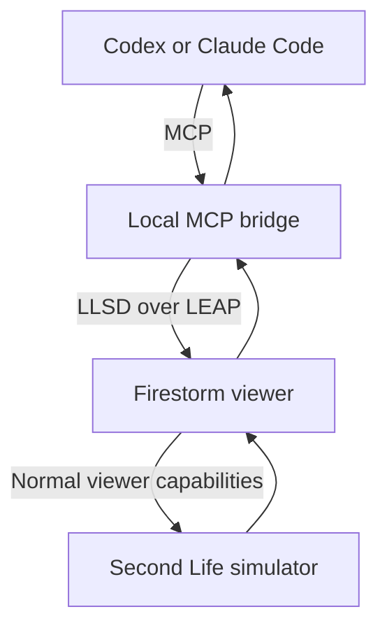

# Firestorm MCP — Proof of Concept

**Project:** AI-assisted Second Life object and HUD development  
**Working name:** Firestorm MCP Bridge  
**Status:** Technical proof-of-concept specification and staged roadmap  
**Prepared:** 18 September 2026

> This document records the long-term design and possible later stages. It is
> not authorization to implement anything beyond the currently approved stage.
> See [`README.md`](README.md) for the current stage boundary and
> [`STAGE_0_LIVE_PROOF.md`](STAGE_0_LIVE_PROOF.md) for verified results.

## 1. Objective

Prove that an AI coding client such as Codex or Claude Code can safely work
with objects and HUDs through Firestorm by performing a complete LSL
development-and-test loop:

1. Connect to a running Firestorm viewer.
2. Discover a HUD worn by the logged-in avatar.
3. Inspect the HUD's linked prims and object inventory.
4. Open an LSL script when the avatar has permission to view it.
5. Replace the script source and ask Second Life to compile it.
6. Receive structured compile success or compile errors.
7. Correct and upload the script again.
8. Touch a specific linked prim in the HUD.
9. Observe runtime messages and take a screenshot with the HUD visible.

The proof does not attempt to build a general-purpose autonomous Second Life
bot. It is a developer tool operating through the user's logged-in viewer and
normal Second Life permissions.

## 2. Main finding

Firestorm already contains much of the required automation layer.

Its source contains **LEAP**, the LLSD Event API Plugin protocol. Firestorm can
launch an external program with the `--leap` command-line option and exchange
structured LLSD messages with that program through standard input and output.

Existing viewer event APIs already provide:

- Attached-object and HUD discovery.
- Nearby-object discovery.
- Object touching by object UUID and face.
- Viewer screenshot capture, with optional UI and HUD rendering.
- Camera control.
- Mouse and keyboard input injection.
- Viewer UI inspection and interaction.
- Normal avatar inventory queries.

This means the proof should not embed an entire MCP server inside Firestorm. A
smaller and safer design is:



The bridge translates a small allowlisted collection of MCP tools into
Firestorm LEAP calls. A custom Firestorm patch supplies only APIs that are
currently missing, if a later stage is explicitly approved.

## 3. What already exists in Firestorm

The official repository is:

- <https://github.com/FirestormViewer/phoenix-firestorm>

Relevant existing components include:

| Capability | Existing implementation | POC use |
| --- | --- | --- |
| External plugin communication | `indra/llcommon/llleap.cpp` | Connect bridge to Firestorm |
| Launch plugin with `--leap` | `indra/newview/llappviewer.cpp` | Start bridge with viewer |
| Discover APIs dynamically | `LLLeapListener::getAPIs/getAPI` | Detect supported viewer features |
| List attachments/HUD roots | `LLAgentListener::getAttachedObjectsList` | Find target HUD |
| List nearby rendered objects | `LLAgentListener::getNearbyObjectsList` | Find rezzed test object |
| Touch object UUID/face | `LLAgentListener::requestTouch` | Activate prim/button |
| Take screenshot | `LLViewerWindowListener::saveSnapshot` | Return visual test evidence |
| Camera control | `LLAgentListener` camera operations | Frame rezzed object |
| Mouse/keyboard injection | `LLWindowListener` | UI fallback and test automation |
| Viewer UI paths and values | `LLWindowListener` and `LLUIListener` | Inspect or operate viewer controls |
| Avatar inventory queries | `LLInventoryListener` | Find inventory items |

The existing touch implementation finds an `LLViewerObject` by UUID and sends
the normal `ObjectGrab` followed by `ObjectDeGrab` message sequence. It also
accepts a face number. A child prim is represented by a viewer object with its
own UUID, so the underlying mechanism can target a linked child rather than
only the root.

The screenshot API already accepts width, height, whether viewer UI should
appear, and whether HUDs should appear. The bridge can read the saved image and
return it as MCP image content.

## 4. Missing viewer APIs

The viewer currently exposes normal inventory through LEAP, but not the
complete task-inventory and LSL editor workflow needed for reliable
object-script development. A later custom build may therefore need one narrow
event API, tentatively named `LLScriptAutomation`.

### 4.1 Linkset inspection

`getLinkset` should accept a root or child object UUID and return:

- Root object UUID.
- Every visible child UUID.
- Link number.
- Prim name and description, when available.
- Root/child flag.
- Local and world position/rotation.
- Number of faces.
- Attachment point and HUD flag.
- Owner UUID.
- Effective modify permission for the logged-in avatar.

This provides stable identifiers for tools such as `touch_link` and prevents
the model from guessing screen coordinates.

### 4.2 Task inventory

`getTaskInventory` should request the selected prim's inventory asynchronously
and return each item's:

- Item UUID.
- Asset/inventory type.
- Name and description.
- Running status for scripts, where available.
- Permissions relevant to the logged-in avatar.

The API must wait for the simulator's inventory response and report a timeout
instead of returning an incomplete list.

### 4.3 Script source

`getScriptSource` should use the same permission checks and asset-fetching path
used by Firestorm's live LSL editor.

It must fail normally if:

- The object cannot be modified.
- The script source cannot be viewed.
- The object or inventory item no longer exists.
- The asset request fails.

It must never expose source that the normal Firestorm script editor would not
allow the user to open.

### 4.4 Write and compile

`updateScriptSource` should use Firestorm's existing task-script upload path and
the region's `UpdateScriptTask` capability. Proposed inputs:

```json
{
  "object_id": "root-or-child-object-uuid",
  "item_id": "script-inventory-item-uuid",
  "source": "default { state_entry() { llOwnerSay(\"Ready\"); } }",
  "target": "mono",
  "running": true,
  "request_id": "unique-operation-id"
}
```

The operation is asynchronous. Its final reply must contain structured results
rather than requiring the AI to scrape the script editor window:

```json
{
  "request_id": "unique-operation-id",
  "compiled": false,
  "installed": false,
  "running": false,
  "errors": [
    {
      "line": 8,
      "column": 21,
      "message": "Syntax error"
    }
  ]
}
```

Firestorm already receives simulator compile responses in its live-script
editor upload callbacks. The new API should reuse that upload implementation
and surface the result through LEAP.

### 4.5 Runtime control

The POC should expose:

- `setScriptRunning`
- `resetScript`
- `getScriptRunning`

Script deletion is deliberately excluded from the first proof because it is
destructive and unnecessary to demonstrate the development loop.

### 4.6 Runtime observations

The bridge should subscribe to viewer events for:

- Nearby chat.
- Owner-directed script messages visible to the viewer.
- Script dialogs and notifications where practical.
- Object/script error messages delivered through normal viewer channels.

Every observation should include a timestamp and source information where
Firestorm supplies it. The proof will use a unique marker such as
`FIRESTORM_MCP_TEST:<request-id>` so unrelated chat cannot be mistaken for a
successful test.

## 5. Proposed MCP tools

The first MCP server should stay intentionally small.

| MCP tool | Purpose | Viewer support |
| --- | --- | --- |
| `viewer_status` | Login state, avatar UUID, region and bridge version | Small wrapper/new API |
| `list_attachments` | List worn objects and HUD roots | Existing |
| `inspect_linkset` | Return root and child link information | New |
| `list_object_inventory` | List contents of one permitted prim | New |
| `read_object_script` | Fetch permitted LSL source | New |
| `write_object_script` | Upload, compile and install source | New |
| `set_script_running` | Start or stop a script | New |
| `reset_script` | Reset script state | New |
| `touch_link` | Touch child UUID/link with face/UV data | Existing touch plus extension |
| `capture_viewer` | Return screenshot as MCP image content | Existing |
| `wait_for_runtime_message` | Wait for matching test output | Bridge subscription/new event |

### `touch_link` input

```json
{
  "root_object_id": "uuid",
  "link_number": 3,
  "face": 0,
  "uv": [0.5, 0.5]
}
```

The bridge resolves the link number to the current child UUID immediately
before touching it. This avoids using a stale UUID after the object is rerezzed
or reattached.

### `capture_viewer` input

```json
{
  "show_ui": false,
  "show_hud": true,
  "width": 1600,
  "height": 900
}
```

The response should contain the PNG as MCP image content plus capture metadata.
Cropping to a specific HUD is a later enhancement; the first proof only needs a
clear full-window capture.

## 6. Proof HUD

Create a disposable HUD owned and created by the development avatar:

| Link | Prim name | Function |
| --- | --- | --- |
| 1 | `MCP POC ROOT` | Root/background |
| 2 | `MCP TEST GREEN` | Sets visible status to green |
| 3 | `MCP TEST RED` | Sets visible status to red |
| 4 | `MCP TEST STATUS` | Changes colour/text after touch |

The root contains one modifiable script named `MCP POC Controller`.

The initial version intentionally contains a compile error. The corrected
version handles `touch_start`, checks `llDetectedLinkNumber(0)`, changes the
status link colour and sends an owner message containing a unique test marker.

This HUD is deliberately isolated from Descendants of Darkness production
objects. No live HUD should be used until the proof has passed repeatedly.

## 7. End-to-end acceptance test

The complete long-term proof passes only if a coding model can complete the
following without manual interaction inside Firestorm after the test begins.

### Test A — Connection and discovery

1. Start the custom Firestorm build with the bridge enabled.
2. Log in and wear the proof HUD.
3. Call `viewer_status`.
4. Call `list_attachments` and identify `MCP POC ROOT`.
5. Call `inspect_linkset` and return all four links with correct link numbers.

**Pass condition:** The model identifies the green and red buttons by
structured prim data, not by guessing from the screenshot.

### Test B — Read and compile failure

1. Call `list_object_inventory` on the HUD root.
2. Find `MCP POC Controller`.
3. Call `read_object_script`.
4. Upload the deliberately broken source with `write_object_script`.

**Pass condition:** The response reports `compiled: false`, does not replace
the installed working asset, and returns an error with useful line/column
information.

### Test C — Correct and compile

1. Correct the source based on the returned error.
2. Call `write_object_script` again.

**Pass condition:** The response reports compiled and installed successfully,
and the script is running.

### Test D — Interact and observe

1. Start `wait_for_runtime_message` using the unique marker.
2. Call `touch_link` for the green button.
3. Receive the expected owner message.
4. Call `capture_viewer` with HUD rendering enabled.

**Pass condition:** The message identifies link 2 and the screenshot visibly
shows the green status.

### Test E — Second linked button

1. Call `touch_link` for the red button.
2. Receive the expected owner message.
3. Capture another screenshot.

**Pass condition:** The message identifies link 3 and the screenshot visibly
shows the red status.

## 8. Safety model

The bridge gives an AI the ability to alter in-world content. The following
controls are required even for the proof:

- MCP endpoint bound only to `127.0.0.1`.
- Random authentication token created for every viewer session.
- Feature disabled by default in Firestorm preferences.
- Visible indicator while MCP control is connected.
- Every mutating action recorded in a local audit log.
- Object writes restricted to objects owned by the logged-in avatar.
- Normal Second Life view/modify permissions enforced by viewer code.
- Script source size and request rate limits.
- Only allowlisted viewer APIs exposed through the MCP bridge.
- No generic operation that can post arbitrary internal event-pump or
  simulator messages.
- No script deletion in the first proof.
- No automatic touching of arbitrary third-party objects.

Before every script replacement, the bridge should keep a local recovery copy
containing object ID, item ID, script name, previous source and timestamp. This
is not a way to bypass Second Life permissions; it is only created when the
normal editor was permitted to retrieve the source.

## 9. Permissions and policy boundaries

The tool must behave exactly like Firestorm's normal editor:

- It cannot read source from a script the avatar is not allowed to open.
- It cannot update an object or script the avatar cannot modify.
- It cannot bypass copy, modify or transfer permissions.
- LSL still compiles and runs on the Second Life simulator, not inside the MCP
  server.
- The bridge does not receive the user's Second Life password.

Linden Lab's Third-Party Viewer Policy applies to any modified viewer
connecting to Second Life. It prohibits circumventing permissions, privacy
controls and security measures, and requires a distinct viewer identifier. If
the custom build is distributed, source-license, branding, disclosure and
privacy requirements also apply:

- <https://secondlife.com/corporate/third-party-viewers>

Firestorm's repository is licensed under LGPL 2.1. The repository recommends
basing viewers intended for use beyond personal experimentation on an official
release branch rather than the nightly `master` branch.

## 10. Implementation stages

### Stage 0 — Existing-API bridge

Build a local bridge using an unmodified/self-compiled Firestorm and prove:

- LEAP connection.
- API discovery.
- Attachment listing.
- Existing UUID/face touch operation.
- Screenshot capture returned to an MCP client.

This isolates communication and image handling before changing viewer script
code.

### Stage 1 — Viewer inspection patch

Add:

- `viewer_status`
- `getLinkset`
- `getTaskInventory`
- Permission metadata

Then verify the proof HUD can be discovered deterministically.

### Stage 2 — LSL patch

Add:

- Script asset retrieval.
- Source update through `UpdateScriptTask`.
- Structured compile results.
- Running state and reset operations.

Reuse Firestorm's live LSL editor and uploader code rather than duplicating
simulator protocols.

### Stage 3 — Runtime testing

Add runtime message subscriptions and complete Tests B–E.

### Stage 4 — Hardening

Add preferences, session authentication, owner restrictions, audit logs,
backups, timeouts, cancellation and recovery from logout, teleport, or object
disappearance.

## 11. Technical risks

| Risk | Treatment |
| --- | --- |
| LEAP and MCP both commonly use standard input/output | Let Firestorm launch a bridge over LEAP stdio; expose MCP to the coding client over localhost Streamable HTTP |
| Asynchronous inventory/assets/uploads | Use operation IDs, explicit timeouts and final result events |
| Object rerezzed or HUD reattached | Resolve root/link number to current UUID immediately before actions |
| Touch depends on face/UV/intersection | Extend existing request to accept complete pick data; default UV to centre |
| Compile succeeds but runtime is wrong | Combine runtime marker messages with screenshots and explicit assertions |
| AI overwrites working code | Capture previous permitted source and require atomic successful upload semantics |
| Screenshot exposes private chat/UI | Default to `show_ui: false`; keep image local to the MCP client |
| Firestorm upstream changes | Keep viewer patch narrow and isolate it in new listener files |
| Custom viewer policy violation | Preserve normal permissions/protocols, use unique identifier and review policy before distribution |

## 12. Definition of success

The full proof is successful when a coding model can receive a deliberately
broken LSL script from a worn test HUD, identify the compiler error, correct
and compile the script, touch two specified linked buttons, observe two unique
runtime responses and return screenshots showing the expected HUD state—without
bypassing permissions and without a person operating the viewer during the
test.

Passing this proof establishes that the same architecture can later support
controlled development of real Descendants of Darkness HUD components.

## 13. Recommended first build

Start with the Stage 0 bridge rather than modifying the script editor
immediately. It confirms the most uncertain integration boundary—Firestorm
LEAP to a modern MCP client—while using capabilities that already exist in the
source.

Once Stage 0 can list the proof HUD, touch a known test attachment and return a
screenshot, seek explicit approval before implementing `LLScriptAutomation` as
a small Firestorm event API. That keeps viewer changes reviewable and makes
each new permission-bearing operation explicit.

